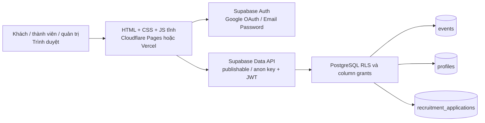

# FEV: kiến trúc Supabase và triển khai



Supabase xác thực người dùng. PostgreSQL quyết định quyền truy cập: khách chỉ đọc sự kiện công khai; thành viên được nộp và xem đơn của mình; quản trị viên quản lý sự kiện và đơn. `registration_link` nằm trong bảng `events` nhưng không được cấp quyền đọc trực tiếp cho trình duyệt; thành viên và quản trị viên lấy nó qua RPC kiểm tra vai trò. `hd=fpt.edu.vn` trong nút Google chỉ là gợi ý tài khoản, còn **Before User Created hook** phía Supabase chặn đăng ký Google mới ngoài miền sinh viên. Hồ sơ mới có vai trò `guest`; Ban Chủ nhiệm cấp `member` hoặc `admin` bằng SQL Editor/quy trình quản trị đáng tin cậy.

## 1. Tạo Supabase project và database

1. Tạo một Supabase project. Trong **Connect** hoặc **Settings → API Keys**, lấy Project URL và **publishable key** (`sb_publishable_...`; legacy `anon` JWT vẫn được hỗ trợ). Không dùng `sb_secret_...` hoặc `service_role` trên web hay trong Git.
2. Trong **SQL Editor**, chạy các migration theo thứ tự: [`202610010001_fev_platform.sql`](../supabase/migrations/202610010001_fev_platform.sql), [`202610010002_restrict_rls_auto_enable.sql`](../supabase/migrations/202610010002_restrict_rls_auto_enable.sql), rồi [`202610020001_auth_refresh_fallback.sql`](../supabase/migrations/202610020001_auth_refresh_fallback.sql). Migration đầu tạo ba bảng, trigger hồ sơ, grants, RLS, RPC và hook; migration thứ hai thu hồi quyền gọi hàm tự bật RLS do Supabase tạo sẵn; migration thứ ba ghi phương thức đăng nhập vào bảng private theo từng session để xử lý refresh khi token không có AMR. Dùng một project mới hoặc kiểm tra migration history trước khi áp dụng vào project đã có dữ liệu; script không thay thế các bảng `fev_*` cũ.
3. Chạy [`supabase/seed_events.sql`](../supabase/seed_events.sql) để nhập 99 sự kiện lịch sử. Seed có thể chạy lại mà không nhân đôi các mục trùng. Phân loại, ảnh bìa và đường dẫn chưa được xác minh trong nguồn cũ nên cần biên tập trong trang quản trị. Danh sách tuyển BTC ban đầu trống cho đến khi admin đánh dấu một sự kiện `is_recruiting`, thêm hạn và các ban tuyển.
4. Trong **Auth → Hooks**, bật hai PostgreSQL hooks: **Before User Created** → `fev_private.before_user_created` và **Custom Access Token** → `fev_private.before_access_token`. Nếu cấu hình qua Supabase CLI, URI tương ứng là `pg-functions://postgres/fev_private/before_user_created` và `pg-functions://postgres/fev_private/before_access_token`. Hook đầu kiểm tra user mới; hook thứ hai kiểm tra mỗi lần cấp JWT, kể cả tài khoản cũ và refresh. Chỉ có SQL file chưa đủ để kích hoạt các hook.
5. Trong **Auth → Providers → Email**, giữ Email/Password bật cho tài khoản quản trị. Giữ **Allow new users to sign up** bật để sinh viên có thể đăng nhập Google lần đầu; đây là công tắc chung, Supabase Console hiện không có công tắc riêng để tắt chỉ đăng ký Email/Password. **Before User Created hook** chỉ cho phép tạo tài khoản qua provider `email` khi địa chỉ nằm trong `fev_private.admin_email_allowlist`; các địa chỉ khác bị từ chối. Chỉ bật Google trong các OAuth providers; tắt các phương thức đăng nhập khác. Tạo tài khoản quản trị riêng bằng Dashboard hoặc Admin API. Thêm email quản trị được phép vào allowlist trước khi tạo tài khoản, rồi cấp `role='admin'` cho profile bằng SQL Editor. Không cho client tự ghi `profiles.role`.

Ví dụ cấp quyền cho một email đã được CLB xác minh (chạy bằng SQL Editor với quyền quản trị):

```sql
-- Thay địa chỉ bằng email quản trị thực tế.
insert into fev_private.admin_email_allowlist (email)
values ('admin@example.com')
on conflict (email) do nothing;

-- Tạo tài khoản trong Auth > Users trước. Lấy UUID đúng từ tài khoản đó,
-- rồi cấp quyền; không cấp role theo một email chưa xác minh.
update public.profiles
set role = 'admin'
where id = 'THAY_BANG_UUID_DA_XAC_MINH';

-- Tương tự, sau khi xác minh tư cách hội viên:
update public.profiles
set role = 'member'
where id = 'THAY_BANG_UUID_SINH_VIEN_DA_XAC_MINH';
```

Nếu project đã có tài khoản ngoài miền từ trước, hook tạo user không chạy lại khi họ đăng nhập. Custom Access Token hook chặn cấp token mới; hãy rà soát `auth.users`/`profiles` cũ và thu hồi phiên hiện tại của tài khoản không hợp lệ. RLS chỉ cấp quyền thành viên/quản trị theo profile đang hoạt động.

## 2. Google OAuth

1. Trong **Google Cloud Console → Google Auth Platform**, cấu hình Audience, Branding và Data Access. Supabase yêu cầu `openid`, `userinfo.email`, `userinfo.profile`.
2. Tạo **OAuth Client ID** loại **Web application**. Authorized JavaScript origin: `https://fpteventclub.io.vn` (thêm `http://127.0.0.1:4173` nếu kiểm tra cục bộ). Authorized redirect URI phải là URL callback **Supabase** hiện trên trang Google provider, thường là `https://<project-ref>.supabase.co/auth/v1/callback` — không phải `dang-nhap.html`.
3. Sao chép Client ID và Client Secret vào **Supabase Auth → Providers → Google**. Client Secret chỉ nằm ở Supabase/Google Cloud.
4. Trong **Supabase Auth → URL Configuration**, đặt Site URL `https://fpteventclub.io.vn` và Redirect URL chính xác `https://fpteventclub.io.vn/dang-nhap.html`. Thêm `http://127.0.0.1:4173/dang-nhap.html` cho local preview nếu cần. Trang dùng PKCE; `member.js` đổi `code` lấy session ở callback.
5. Thử Google với một email `@fpt.edu.vn` đã cấp vai trò `member`, một email FPT chưa cấp vai trò, và một email ngoài miền. Chỉ trường hợp đầu được nộp đơn. Email ngoài miền đăng ký mới phải bị hook chặn.
6. Trên Supabase project thật, thử làm mới token sau khi đăng nhập bằng Google của thành viên và Email/Password của admin (ví dụ gọi `supabase.auth.refreshSession()`). Hook đọc `claims.amr` nếu có (dạng object hoặc chuỗi); khi AMR thiếu, `null` hoặc rỗng, hook dùng phương thức đã ghi cho đúng `session_id` và `user_id` trong `fev_private.session_auth_methods`. AMR không rỗng nhưng không có phương thức đăng nhập hợp lệ, hoặc phiên cũ thiếu cả AMR lẫn bản ghi, sẽ bị từ chối; người dùng cần đăng xuất rồi đăng nhập lại. Kiểm tra cả hai loại tài khoản sau khi áp dụng migration thứ ba và trước khi trỏ domain production.

Tài liệu gốc: [Supabase Google login](https://supabase.com/docs/guides/auth/social-login/auth-google), [Redirect URLs](https://supabase.com/docs/guides/auth/redirect-urls), [Before User Created hook](https://supabase.com/docs/guides/auth/auth-hooks/before-user-created-hook), [Custom Access Token hook](https://supabase.com/docs/guides/auth/auth-hooks/custom-access-token-hook), [JWT claims](https://supabase.com/docs/guides/auth/jwt-fields).

## 3. Cấu hình bản build tĩnh

`supabase-client.js` nhập SDK từ CDN và có hai placeholder công khai. `scripts/build-static.mjs` thay placeholder bằng các biến môi trường khi tạo `dist/`. Đây là thông tin public dùng với RLS, không phải secret quản trị.

```powershell
$env:SUPABASE_URL = 'https://PROJECT_REF.supabase.co'
$env:SUPABASE_PUBLISHABLE_KEY = 'sb_publishable_...'
$env:REQUIRE_SUPABASE_CONFIG = '1'
node scripts/build-static.mjs
node server.mjs
```

Mở `http://127.0.0.1:4173`. Biến `SUPABASE_ANON_KEY` là alias cho legacy anon JWT nếu project chưa chuyển sang publishable key. Build từ chối key có quyền `service_role`/`sb_secret_`. Lệnh build không có biến cấu hình tạo bản preview với thông báo chưa cấu hình; `REQUIRE_SUPABASE_CONFIG=1` làm build thất bại nếu thiếu giá trị, phù hợp CI. Không chỉnh trực tiếp `dist/`.

## 4. GitHub → Cloudflare Pages hoặc Vercel

Mã nguồn hiện ở repository `https://github.com/longluongexotic-droid/fpteventclub.git`, nhánh `main`, remote `origin`. Sau khi hoàn tất cấu hình Supabase và kiểm tra bản build, chạy trong thư mục repository:

```powershell
git status
git add -A
git commit -m "Migrate FEV website to Supabase"
git push origin main
```

Push sẽ kích hoạt triển khai tự động trên dịch vụ đã liên kết. Nếu repository có GitHub Pages workflow cũ, workflow này cũng cần `SUPABASE_URL` và `SUPABASE_PUBLISHABLE_KEY` (hoặc legacy `SUPABASE_ANON_KEY`) trong GitHub Secrets mới có thể build; ngắt triển khai GitHub Pages sau khi chuyển domain ổn định sang nền tảng mới.

**Cloudflare Pages:** Workers & Pages → Create → Pages → Connect to Git. Chọn repository/production branch. Framework preset **None**, root directory là repository này, Build command `node scripts/build-static.mjs`, Build output directory `dist`. Trong Settings → Environment variables đặt `SUPABASE_URL`, `SUPABASE_PUBLISHABLE_KEY`, `REQUIRE_SUPABASE_CONFIG=1` cho production (và preview nếu muốn thử OAuth). Sau bản deploy thử nghiệm, mở Custom domains → Set up a domain → nhập `fpteventclub.io.vn`. Đây là apex domain, nên cần domain được quản lý trong Cloudflare zone và nameserver trỏ về Cloudflare. Kiểm tra lại các bản ghi DNS khác, đặc biệt MX/TXT email, khi chuyển nameserver. [Cloudflare Git integration](https://developers.cloudflare.com/pages/get-started/git-integration/), [Custom domains](https://developers.cloudflare.com/pages/configuration/custom-domains/).

**Vercel:** Add New → Project → Import Git repository. Framework preset **Other**, Build command `node scripts/build-static.mjs`, Output directory `dist`, root directory là repository này. Đặt ba biến môi trường trên trong Settings → Environment Variables. Trong Project → Settings → Domains, thêm `fpteventclub.io.vn`, lấy chính xác bản ghi DNS mà Vercel hiển thị và cấu hình tại nơi quản lý DNS. Sau khi Vercel xác nhận domain và cấp HTTPS, cập nhật Supabase Site URL/Redirect URL theo domain chính. [Vercel builds](https://vercel.com/docs/builds), [Custom domain](https://vercel.com/docs/domains/set-up-custom-domain).

Chỉ một nền tảng nên nhận domain chính tại một thời điểm. Trước khi đổi DNS, kiểm tra URL preview, đăng nhập Google, quyền admin/member/guest và các trạng thái gửi đơn. Không thể hoàn tất kết nối OAuth, chạy migration trên project thật hoặc đổi DNS nếu chưa có quyền truy cập Supabase/Google Cloud/hosting/domain.
